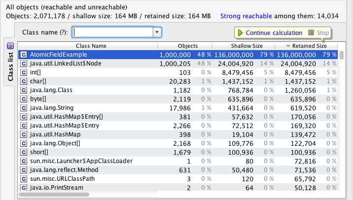

> 原文: http://normanmaurer.me/blog/2013/10/28/Lesser-known-concurrent-classes-Part-1/
> 作者: [Norman Maurer](https://github.com/normanmaurer)
> 译者: [kezhenxu94](https://github.com/kezhenxu94)

今天我想和大家讨论一个鲜为人知的工具类, 当在 Java 中涉及到原子操作的时候经常会使用到这个类; 只要你使用过 `java.util.concurrent` 包来处理一些实际工作中的问题时, 你一定会对 `Atomic*` 相关的类有所了解, 这些类能够帮助你对引用类型, `Long` 类型, `Integer` 类型和 `Boolean` 类型进行原子操作;

这些相关的类都位于包 `java.util.concurrent.atomic` 下. 如:

- `AtomicBoolean`
- `AtomicInteger`
- `AtomicReference`
- `AtomicLong`
- ... ...

这些类的使用都非常简单, 就像下面这样:

```java
AtomicLong atomic = new AtomicLong(0);
atomic.compareAndSet(0, 1);
// ...
```

那使用这些类有什么大问题? 问题就在于内存的使用, 他们占用了额外的内存...如果能够只用一个 `volatile long` 类型, 省下一次对象内存分配达到节省内存的效果, 岂不是更好?

> 那还用说, 两全其美!!!

这完全就是 `Atomic*FieldUpdater` 类族的作用所在. 他们能让你直接对 `volatile` 字段进行原子操作, 这样一来, 你原先使用像 `AtomicLong` 这样的类所需要分配的对象内存空间就得以省下. 别怀疑, 这确实奏效, 因为 `Atomic*FieldUpdater` 通常作为静态变量存在, 因而不需要为每一个对象都新建一个实例.

> 还更简洁, 不是吗???

所以, 为了取代上面对 `AtomicLong` 的使用, 现在我们代码看起来是这样的:

```java
private static final AtomicLongFieldUpdater<TheDeclaringClass> ATOMIC_UPDATER =
        AtomicLongFieldUpdater.newUpdater(TheDeclaringClass.class, "atomic");

private volatile long atomic;

public void yourMethod() {
    ATOMIC_UPDATER.compareAndSet(this, 0, 1);
    // ...
    // ...
}
```

在创建 `AtomicLongFieldUpdater` 实例的时候, 底层实际使用到了一些反射的"魔法"; 作为参数传递进来的字段名(此例中的 `atomic`) 会被用来查找相应的 `volatile` 字段, 因此你必须确保这个字段名和你实际声明的字段名称一致; 这也是使用 `Atomic*FieldUpdater` 不太爽的地方之一, 就是它的约束比较弱, 无法让编译器在编译阶段检测字段名是否匹配; 所以要特别留意;

你可能会问这值得吗? 能省下多少内存啊? 答案一如既往地, "视情况而定"... 如果你只是新建了千八百个使用到 `Atomic*` 的实例而已, 那可能根本就不值得换 `AtomicLongFieldUpdater`; 但是还是有一些情况下, 你需要创建上百万个这样的实例, 并且他们还需要存活相当长一段时间, 在那种情况用和不用就会有比较大的差别了;

以 [Netty](http://github.com/netty/netty) 为例, 我们在 `Channel`, `DefaultChannelPipeline` 和 `DefaultChannelHandlerContext` 中使用到了 `AtomicLong` 和 `AtomicReference` 等类. 当每次有新的连接建立时, 就会创建一个新的 `Channel` 实例和一个新的 `ChannelPipeline` 实例, 每个 `DefaultChannelPipeline` 实例拥有 10 个以上的 `DefaultChannelHandlerContext` 也是常有的事; 对于非阻塞的服务来说, 一次性处理大量的并发请求也是正常的, 在我们的案例中, 就是创建了以上提到的相关类的非常非常多实例, 更糟的是, 这些实例通常是长时间存活的, 因为服务连接通常是 `long-living` 的;

Netty 的其中一个用户测试了 1M+ 个并发连接, 观察到很大一部分堆内存占用, 是由我们使用的 `AtomicLong` 和 `AtomicReference` 实例占用的; 通过将他们替换成 `AtomicField*Updater`, 可以节省下大概 500MB 的内存, 再结合其他优化方式, 总共能够降低内存达到 3GB 之多;

> 关于 Netty 的这个优化, 请参考 [#920](https://github.com/netty/netty/issues/925) and [#995](https://github.com/netty/netty/issues/995)

有一件事要注意的是, 没有 `AtomicBooleanFieldUpdater` 这样的类可以用来替换 `AtomicBoolean`; 但也不是个问题, 完全可以使用 `AtomicIntegerFieldUpdater` 来替代, 用 `0` 表示 `false` 用 `1` 表示 `true`, 完美解决 ;)

## 给点数据瞧瞧

现在有了一些理论基础了, 让我们来证明一下; 我们将做一个简单的测试: 新建一个类, 包含了 10 个 `AtomicLong` 和 10 个 `AtomicReference` 的实例, 然后实例化这个类 1M 次, 模仿我们以上提到的 Netty 中的案例;

先来看看最终的代码:

```java
public class AtomicExample {

    final AtomicLong atomic1 = new AtomicLong(0);
    final AtomicLong atomic2 = new AtomicLong(0);
    final AtomicLong atomic3 = new AtomicLong(0);
    final AtomicLong atomic4 = new AtomicLong(0);
    final AtomicLong atomic5 = new AtomicLong(0);
    final AtomicLong atomic6 = new AtomicLong(0);
    final AtomicLong atomic7 = new AtomicLong(0);
    final AtomicLong atomic8 = new AtomicLong(0);
    final AtomicLong atomic9 = new AtomicLong(0);
    final AtomicLong atomic10 = new AtomicLong(0);
    final AtomicReference atomic11 = new AtomicReference<String>("String");
    final AtomicReference atomic12 = new AtomicReference<String>("String");
    final AtomicReference atomic13 = new AtomicReference<String>("String");
    final AtomicReference atomic14 = new AtomicReference<String>("String");
    final AtomicReference atomic15 = new AtomicReference<String>("String");
    final AtomicReference atomic16 = new AtomicReference<String>("String");
    final AtomicReference atomic17 = new AtomicReference<String>("String");
    final AtomicReference atomic18 = new AtomicReference<String>("String");
    final AtomicReference atomic19 = new AtomicReference<String>("String");
    final AtomicReference atomic20 = new AtomicReference<String>("String");

    public static void main(String[] args) throws Exception {
        List<AtomicExample> list = new LinkedList<AtomicExample>();
        for (int i = 0; i < 1000000; i++) {
            list.add(new AtomicExample());
        }
        System.out.println("Created instances 1000000");

        System.in.read();
    }
}
```

你可能会觉得在现实中不太可能有这么多个 `AtomicLong` 和 `AtomicReference` 吧, 请再仔细想想; 在同一个类中是不太可能有这么多, 但如果这些 `AtomicLong` 分布在多个相互关联的类中呢, 比如这些类都是由于同一个服务连接而创建的;

现在让我们看看他们究竟占用了多少的内存; 这里使用了 `YourKit` 工具来分析, 但是任何其他能够分析堆栈的工具也应该都是可以的;


如你所见, `AtomicLong` 和 `AtomicReference` 占用了大约 400MB 的内存, 而 `AtomicExample` 本身只占用了 96MB; 使得每个 `AtomicExample` 实例总共占用约 500MB 的内存;

现在让我们实现第二个版本的 `AtomicExample`, 使用 `volatile long` 和 `AtomicLongFieldUpdater` 来替代 `AtomicLong`, 同时我们使用 `volatile String` 和 `AtomicReferenceFieldUpdater` 来替代 `AtomicReference`;

代码如下:

```java
public class AtomicFieldExample {

    volatile long atomic1 = 0;
    volatile long atomic2 = 0;
    volatile long atomic3 = 0;
    volatile long atomic4 = 0;
    volatile long atomic5 = 0;
    volatile long atomic6 = 0;
    volatile long atomic7 = 0;
    volatile long atomic8 = 0;
    volatile long atomic9 = 0;
    volatile long atomic10 = 0;
    volatile String atomic11 = "String";
    volatile String atomic12 = "String";
    volatile String atomic13 = "String";
    volatile String atomic14 = "String";
    volatile String atomic15 = "String";
    volatile String atomic16 = "String";
    volatile String atomic17 = "String";
    volatile String atomic18 = "String";
    volatile String atomic19 = "String";
    volatile String atomic20 = "String";

    static final AtomicLongFieldUpdater<AtomicFieldExample> ATOMIC1_UPDATER = 
            AtomicLongFieldUpdater.newUpdater(AtomicFieldExample.class, "atomic1");
    static final AtomicLongFieldUpdater<AtomicFieldExample> ATOMIC2_UPDATER = 
            AtomicLongFieldUpdater.newUpdater(AtomicFieldExample.class, "atomic2");
    static final AtomicLongFieldUpdater<AtomicFieldExample> ATOMIC3_UPDATER = 
            AtomicLongFieldUpdater.newUpdater(AtomicFieldExample.class, "atomic3");
    static final AtomicLongFieldUpdater<AtomicFieldExample> ATOMIC4_UPDATER = 
            AtomicLongFieldUpdater.newUpdater(AtomicFieldExample.class, "atomic4");
    static final AtomicLongFieldUpdater<<AtomicFieldExample> ATOMIC5_UPDATER = 
            AtomicLongFieldUpdater.newUpdater(AtomicFieldExample.class, "atomic5");
    static final AtomicLongFieldUpdater<AtomicFieldExample> ATOMIC6_UPDATER = 
            AtomicLongFieldUpdater.newUpdater(AtomicFieldExample.class, "atomic6");
    static final AtomicLongFieldUpdater<AtomicFieldExample> ATOMIC7_UPDATER = 
            AtomicLongFieldUpdater.newUpdater(AtomicFieldExample.class, "atomic7");
    static final AtomicLongFieldUpdater<AtomicFieldExample> ATOMIC8_UPDATER = 
            AtomicLongFieldUpdater.newUpdater(AtomicFieldExample.class, "atomic8");
    static final AtomicLongFieldUpdater<AtomicFieldExample> ATOMIC9_UPDATER = 
            AtomicLongFieldUpdater.newUpdater(AtomicFieldExample.class, "atomic9");
    static final AtomicLongFieldUpdater<AtomicFieldExample> ATOMIC10_UPDATER = 
            AtomicLongFieldUpdater.newUpdater(AtomicFieldExample.class, "atomic10");
    static final AtomicReferenceFieldUpdater<AtomicFieldExample, String> ATOMIC11_UPDATER = 
            AtomicReferenceFieldUpdater.newUpdater(AtomicFieldExample.class, String.class, "atomic11");
    static final AtomicReferenceFieldUpdater<AtomicFieldExample, String>ATOMIC12_UPDATER = 
            AtomicReferenceFieldUpdater.newUpdater(AtomicFieldExample.class, String.class, "atomic12");
    static final AtomicReferenceFieldUpdater<AtomicFieldExample, String> ATOMIC13_UPDATER = 
            AtomicReferenceFieldUpdater.newUpdater(AtomicFieldExample.class, String.class, "atomic13");
    static final AtomicReferenceFieldUpdater<AtomicFieldExample, String> ATOMIC14_UPDATER = 
            AtomicReferenceFieldUpdater.newUpdater(AtomicFieldExample.class, String.class, "atomic14");
    static final AtomicReferenceFieldUpdater<AtomicFieldExample, String> ATOMIC15_UPDATER = 
            AtomicReferenceFieldUpdater.newUpdater(AtomicFieldExample.class, String.class, "atomic15");
    static final AtomicReferenceFieldUpdater<AtomicFieldExample, String> ATOMIC16_UPDATER = 
            AtomicReferenceFieldUpdater.newUpdater(AtomicFieldExample.class, String.class, "atomic16");
    static final AtomicReferenceFieldUpdater<AtomicFieldExample, String>ATOMIC17_UPDATER = 
            AtomicReferenceFieldUpdater.newUpdater(AtomicFieldExample.class, String.class, "atomic17");
    static final AtomicReferenceFieldUpdater<AtomicFieldExample, String> ATOMIC18_UPDATER = 
            AtomicReferenceFieldUpdater.newUpdater(AtomicFieldExample.class, String.class, "atomic18");
    static final AtomicReferenceFieldUpdater<AtomicFieldExample, String> ATOMIC19_UPDATER = 
            AtomicReferenceFieldUpdater.newUpdater(AtomicFieldExample.class, String.class, "atomic19");
    static final AtomicReferenceFieldUpdater<<AtomicFieldExample, String>ATOMIC20_UPDATER = 
            AtomicReferenceFieldUpdater.newUpdater(AtomicFieldExample.class, String.class, "atomic20");

    public static void main(String[] args) throws Exception {
        List<AtomicFieldExample> list = new LinkedList<<AtomicFieldExample>();
        for (int i = 0; i < 1000000; i++) {
            list.add(new AtomicFieldExample());
        }
        System.out.println("Created instances 1000000");

        System.in.read();
    }
}
```

看起来代码膨胀了很多, 希望能够有所回报吧; 让我们再来看看内存的使用情况吧:



从截图中可以看到, 内存占用少了很多; 实际上现在 1M 个 `AtomicFieldExample` 的实例总共占用不到 136MB 的内存; 和前面的基准内存占用比起来, 确实优化不少;

你可能又会问, 为什么 `AtomicFieldExample` 本身反而比 `AtomicExample` 大了? 这是由于我们需要额外的内存来存放引用和 `long` 字段; `AtomicFieldExample` 有 10 个引用和 10 个 `long` 字段:

- 10 * 8 bytes (`long`)
- 10 * 4 bytes (引用)
- 1 * 16 bytes (本身)

`AtomicExample` 有 20 引用:

- 20 * 4 bytes (引用)
- 1 * 16 bytes (本身)

所以到头来还是"划算"的, 因为我们现在省下了原本用来存放 `AtomicLong` 和 `AtomicReference` 的内存了; 简单直接点讲就是: **每个对象都要占用一定的内存**;

除了上面说的节约了内存, 还有一些我们没有提到过的其他好处:

- 由于少了很多对象, 垃圾回收器就少了很多需要关注的对象, 毕竟他本来需要追踪每一个对象的引用;
- 我们也省下了 Java 内置的, 对于每个对象都需要默认创建的监视器 (monitor), (译注: 关于 monitor, 可以参看笔者另一篇文章 

## 总结

总结一下, 使用对应的 `volatile` + `Atomic*FieldUpdater` 来替换 `Atomic*` 对象可能有所裨益; 但是究竟能有多大收益, 就要看你在哪些地方替换, 替换了什么了; 不过收益有时可能会非常巨大, 特别是在很多 "小对象" 的情况下;

我们再来做一次数学题:

- `AtomicLong` = 24 bytes + 4 bytes (指向它本身的引用)
- `volatile long` = 8 bytes

这就省下了 16 bytes 了!

## 致谢

特别感谢 [Nitsan Wakart](https://twitter.com/nitsanw), [Michael Nitschinger](https://twitter.com/daschl) 和 [Benoît Sigoure](https://twitter.com/tsunanet) 的 review 和反馈;


